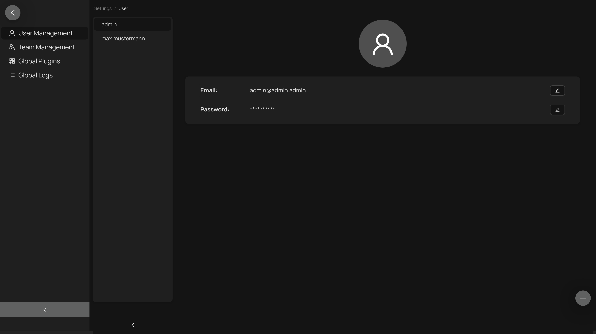

# Appsfactory "Metadata Platform"

### Overview

This project is an application for the storage and management of project metadata. This repository contains both an ASP.NET Core backend providing a RESTful API and a VUE 3 web frontend.

### Project Structure
- `.github`:
  - `workflows`: Github Actions
- `.vscode`: Config for IDE
- `deployment`: Files needed to build and deploy the project
  - `docker`: Docker compose files and dockerfiles
- `screenshots`: Screenshots of the frontend webpage
- `src`: Source files
  - `backend`: Files of the backend project
  - `frontend`: Files of the frontend project

### Prerequisites

-   [.NET 8 SDK](https://dotnet.microsoft.com/download/dotnet/8.0)
- Node.js (v16+)
- Corepack (manages package managers like Yarn)
- Yarn

### Installation

1. Clone the repository:

    ```sh
    git clone <repository-url>
    cd project-metadata-platform
    ```

2. Restore the backend dependencies:
    ```sh
    cd src/backend
    dotnet restore
    ```
3. Enable Corepack and install frontend dependencies:
   ```sh
   cd ../../src/frontend
   corepack enable
   yarn install
   ```
### Local Deployment
The folder deployment/docker folder contains a minimal docker compose file for local deployment for testing purposes. To build and start the the application run this command in the directory:
   ```sh
   docker compose -f docker-compose-local-build.yml up --build -d
   ```
The frontend is available at `http://localhost:8090` and the Swagger UI of the backend API is available at `http://localhost:8090/swagger/index.html`.

## Appsfactory "Metadata Platform" Backend
[](https://sonarcloud.io/summary/new_code?id=appsfactory_project-metadata-platform-backend)
[](https://sonarcloud.io/summary/new_code?id=appsfactory_project-metadata-platform-backend)
[](https://sonarcloud.io/summary/new_code?id=appsfactory_project-metadata-platform-backend)
### Overview

This project is an ASP.NET Core application using Entity Framework Core and PostgreSQL. It provides a RESTful API for managing metadata of projects.

### Scripts

##### Build:

```sh
dotnet build
```

Builds the app.

##### Run:

Running the app locally requires a PostgreSQL database. The deployment folder already contains a corresponding docker compose file.
First, install Docker and Docker Compose: https://docs.docker.com/get-docker/ and https://docs.docker.com/compose/install/.
Then, run the following command inside the folder deployment/docker to start the database container:

```sh
docker compose -f docker-compose-database.yml up --remove-orphans -d
```
When using Visual Studio Code its enough to start debugging wth the configuration `C#: PMP Backend Debug`. A pre-launch task will automatically start and post-debug task will automatically stop the database.

Next, open a terminal in the ProjectMetadataPlatform.Api directory and run the following command to apply any existing migrations to the database:

With powershell (You may have to run `dotnet tool update --global PowerShell` first):

```pwsh
pwsh .\dotnet_ef.ps1 database update
```

With bash:

````sh
 sh ./dotnet_ef.sh database update
 ```

You can now run the app with the following command or an IDE of your choice:

```sh
dotnet run
````

#### Test:

```sh
dotnet test
```

Runs unit tests with NUnit.

#### Project Structure

The project is build following the Clean Architecture principles. The project is structured as follows:

-   `ProjectMetadataPlatform.Application`: Application layer
-   `ProjectMetadataPlatform.Domain`: Domain layer
-   `ProjectMetadataPlatform.Infrastructure`: Infrastructure layer
-   `ProjectMetadataPlatform.Api`: Api/Presentation layer

-   `tests/ProjectMetadataPlatform.Application.Tests`: Application layer tests
-   `tests/ProjectMetadataPlatform.Domain.Tests`: Domain layer tests
-   `tests/ProjectMetadataPlatform.Infrastructure.Tests`: Infrastructure layer tests
-   `tests/ProjectMetadataPlatform.Api.Tests`: Api/Presentation layer tests

### Development

#### Running the application

See the [Run-Script](#run) section for how to run the application with a local database.

#### Database Migrations

When changing the domain models or their configurations in the infrastructure layer, you need to create a new migration.

1. Create a local database container according to the instructions in the [Run-Script](#run) section.
2. Open a terminal in the `ProjectMetadataPlatform.Api` directory.
3. Run the following command to apply the existing migrations to the database:

    With powershell:

    ```pwsh
    pwsh .\dotnet_ef.ps1 database update
    ```

    With bash:

    ```sh
     sh ./dotnet_ef.sh database update
    ```

4. Make the required changes to the domain models or their configurations.
5. Run the following command to create a new migration:

    With powershell:

    ```pwsh
    pwsh .\dotnet_ef.ps1 migrations add <migration-name>
    ```

    With bash:

    ```sh
     sh ./dotnet_ef.sh migrations add <migration-name>
    ```

6. Commit the generated migration files. The files can be found in the `ProjectMetadataPlatform.Infrastructure/Migrations` directory.
7. Push the changes to github and create a merge request.
8. Run the following command to create the migration script, then add it to the merge request description:

    With powershell:

    ```pwsh
    pwsh .\dotnet_ef.ps1 migrations script <name-of-the-last-migration>
    ```

    With bash:

    ```sh
     sh ./dotnet_ef.sh migrations script <name-of-the-last-migration>
    ```

9. Run the migration script on the database once the merge request is approved and merged onto main.

## Appsfactory "Metadata Platform" Frontend
[](https://sonarcloud.io/summary/new_code?id=appsfactory_project-metadata-platform-frontend)
[](https://sonarcloud.io/summary/new_code?id=appsfactory_project-metadata-platform-frontend)
[](https://sonarcloud.io/summary/new_code?id=appsfactory_project-metadata-platform-frontend)
### Overview

This project is a Vue 3 web application with TypeScript integration, utilizing modern tools like Vite, ESLint, Prettier, and Vitest for development and testing.

### Scripts

**Development**:

```sh
yarn dev
```

Runs the app in development mode.

**Build**:

```sh
yarn build
```

Builds the app for production.

**Preview**:

```sh
yarn preview
```

Previews the production build.

**Lint**:

```sh
yarn lint
```

Lints the codebase with ESLint. Recommended to execute before committing.

**Format**:

```sh
yarn format
```

Formats the codebase with Prettier. Recommended to execute before committing.

**Test**:

```sh
yarn test
```

Runs unit tests with Vitest.

**Test UI**:

```sh
yarn test:ui
```

Runs the Vitest UI.

### Project Structure

- `public`: Static public files like favicon or fonts
- `src`: Source files
  - `assets`: Static assets like images
  - `components`: Vue reusable components
  - `models`: TypeScript models
  - `router`: Vue router configuration
  - `services`: API services
  - `store`: Pinia stores
  - `views`: Vue views/pages

### Environment Variables

...


### Development

#### Debugging the application

When using Visual Studio Code you can debug the application with either Chrome or Firefox when using the debug configurations `Chrome: PMP Frontend Debug` or `Firefox: PMP Frontend Debug`. A pre-launch task will automatically run the application in development mode, so that the browser debugger can attach and a post-debug task will cstop the application. When using a version of Chrome / Firefox that was installed via snap package, Flatpak etc. it might be necessary to alter the launch.json and add a tmp directionary for the browser to use.
Otherwise, when not using Visual Studio Code, just start the application with: 
```sh
yarn dev
```
#### Development with Backend Service

To use the backend service during development, one needs to run the backend service locally. 

1. Start the backend as described in the [Run-Script](#run) section.
2. The backend service should now be available at `http://localhost:5173`. This URL is already configured in the `.env` file of the frontend. Simply use `import.meta.env.VITE_BACKEND_URL + "/<your-endpoint>"` to access the api. For example:

   ```ts
   const response = await fetch(import.meta.env.VITE_BACKEND_URL + '/projects');
   ```

3. The env files are already configured to use the correct backend URLs in the staging and production environments. No further changes are necessary after local development is over.
4. The Swagger UI of the backend service is available at `http://localhost:5173/swagger/index.html`.
5. To stop the backend service, hit `Ctrl+C` in the terminal where the service is running or when using Visual Studio Code stop the backend debugging session.

### Frontend Screenshots
Login Screen

Project View

Project View - Light Mode

Create Project View

Edit Project View

Settings View - User Management

Settings View - Team Management

Settings View - Global Plugins

Settings View - Global Logs - Light Mode
